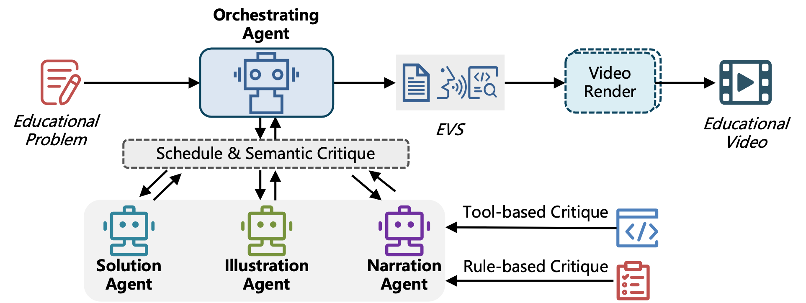

  

# Beyond End-to-End Video Models: An LLM-Based Multi-Agent System for Educational Video Generation

### [📄 Paper]() | [🌐 Project Page](https://robitsg.github.io/LASEV)

## Overview

LASEV is a hierarchical LLM-based multi-agent system for generating high-quality educational videos from problems. Rather than end-to-end pixel synthesis, our system constructs structured executable video scripts that are deterministically compiled into synchronized visuals and narration.

## Framework

  
  
<i>Multi-agent system architecture with Orchestrating Agent coordinating working agents</i>

## Key Features

- 🤖 Multi-agent architecture with specialized working agents for reasoning, visualization, and narration
- 🎓 Designed specifically for educational content generation
- 📊 Throughput exceeding 1M videos per day
- 💰 95%+ cost reduction compared to industry standards
- ✅ High acceptance rate in production deployment

## Citation

TBA
